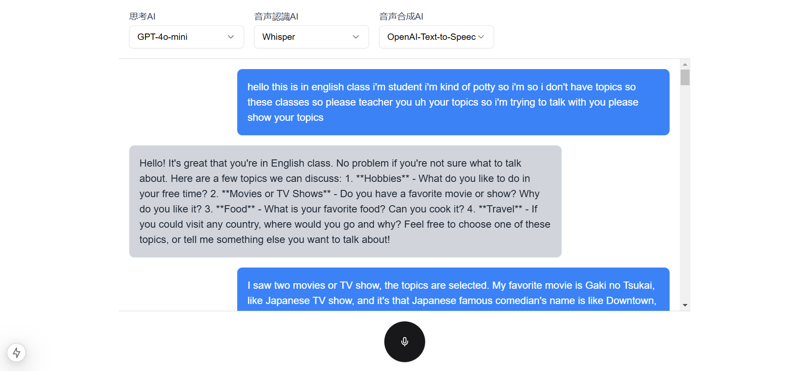

# Speak Ease

音声対話によるAIアシスタントアプリケーション。OpenAIのAPIを活用し、音声入力からAI応答、音声合成までをシームレスに実現します。



## 概要

- 音声入力による対話
- リアルタイムの音声認識（Whisper）
- AI応答生成（GPT-4）
- 音声合成による応答（OpenAI TTS）
- 複数のAIモデル選択機能

## 必要要件

- Node.js v20以上
- Python 3.8以上
- Docker & Docker Compose
- OpenAI API Key

## クイックスタート

1. リポジトリのクローン
```bash
git clone https://github.com/koinunopochi/speak-ease.git
cd speak-ease
```

2. 環境変数の設定
```bash
# フロントエンド
cd apps/frontend/next
cp .env.sample .env
# .envにOpenAI APIキーを設定
MY_OPENAI_API_KEY=your-api-key
```

3. アプリケーション起動
```bash
# プロジェクトルートで実行
docker compose up -d  # バックエンド起動

# フロントエンド起動
cd apps/frontend/next
pnpm install
pnpm dev
```

4. ブラウザで http://localhost:3000 にアクセス

## 技術スタック

- フロントエンド
  - Next.js
  - TypeScript
  - TailwindCSS
  - OpenAI API（Client）

- バックエンド
  - Python (Flask)
  - pydub（音声処理）

- インフラ
  - Docker
  - Docker Compose
